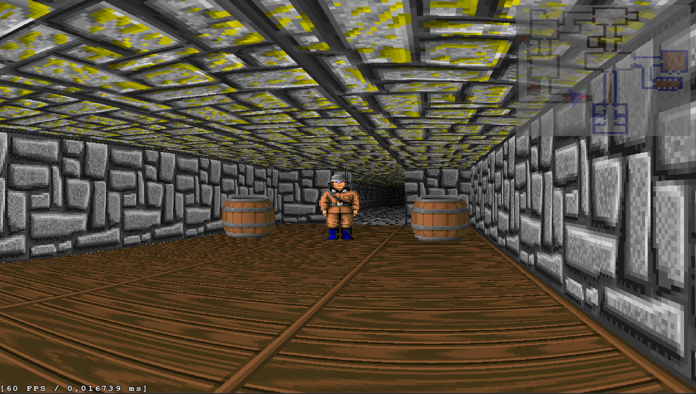

# WolfRender

A Wolfenstein 3D-style raycasting engine implemented in C# using SFML.

## Overview

WolfRender is a raycasting renderer that creates pseudo-3D environments similar to classic games like Wolfenstein 3D and Doom. The engine uses raycasting techniques to create the illusion of 3D from a 2D map.

## How the Rendering Works

### Raycasting Technique

The rendering uses the following approach:

1. **Ray Projection**: From the player position, rays are cast at regular angular intervals across the player's field of view (FOV).
2. **Wall Detection**: Each ray is extended until it hits a wall in the 2D map.
3. **Distance Calculation**: The distance between the player and the wall intersection is calculated, accounting for the "fishbowl effect" using perpendicular distance.
4. **Column Rendering**: Each vertical column on the screen corresponds to a single ray. The height of the wall rendered in that column is inversely proportional to the distance.
5. **Texture Mapping**: Wall textures are mapped to each column based on where the ray hits the wall.
6. **Shading**: A distance-based shading effect is applied using the configurable shading exponent.
7. **Parallel Processing**: Since each ray/column calculation is independent of others, the renderer leverages parallel operations for significant performance optimization.

### Sprite Rendering

Entities (enemies, items, etc.) are rendered as billboard sprites:

1. Sprites are sorted by distance from the player
2. Each sprite is transformed to screen space
3. Sprites are drawn in back-to-front order to handle occlusion
4. Line of sight checks ensure the player can only hit visible entities

## Key Features

- First-person navigation with WASD controls
- Mouse-based rotation with adjustable FOV
- Texture mapping for walls and sprites
- Distance-based shading and lighting effects
- Collision detection
- Entity animations (idle, death)
- Weapon animations and shooting mechanics
- Line of sight calculations

## Controls

- **W/A/S/D**: Movement
- **Mouse**: Look around
- **Mouse Wheel**: Adjust FOV
- **Middle Mouse Button**: Reset FOV to default
- **Left Mouse Button**: Shoot
- **M**: Toggle mouse visibility
- **R**: Respawn all entities
- **Page Up/Down**: Adjust shading intensity
- **Home**: Reset shading to default
- **Escape**: Exit the application

## Technical Details

- Built with C# and .NET
- Uses SFML (Simple and Fast Multimedia Library) for graphics
- Implements Dependency Injection pattern via interfaces
- Uses animation system for weapon and entity visuals

## Architecture

The project follows a service-based architecture with key components including:

- **MapService**: Manages the 2D map data
- **MapRendererService**: Handles raycasting and rendering
- **PlayerService**: Manages player movement, rotation, and actions
- **EntityService**: Handles game entities like enemies
- **CollisionService**: Detects collisions between entities and walls
- **AnimationService**: Manages sprite animations

## Setup and Installation

1. Ensure you have .NET installed
2. Clone this repository
3. Restore dependencies
4. Build and run the project

## Assets

The project uses sprite sheets for:

- Wall textures
- Weapon animations
- Enemy character animations

## Contributing

Contributions are welcome! Please feel free to submit a Pull Request.
